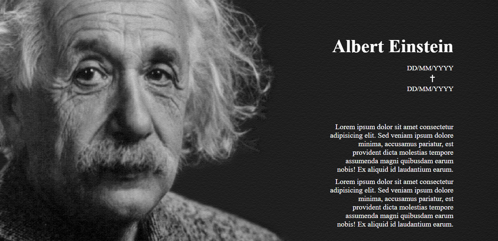
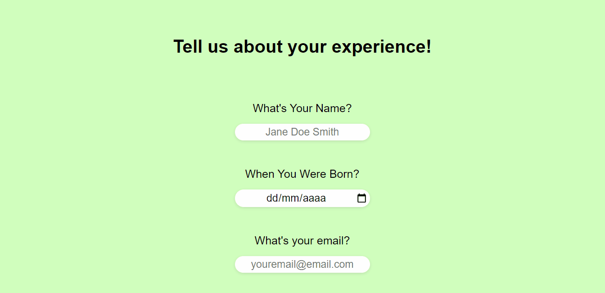
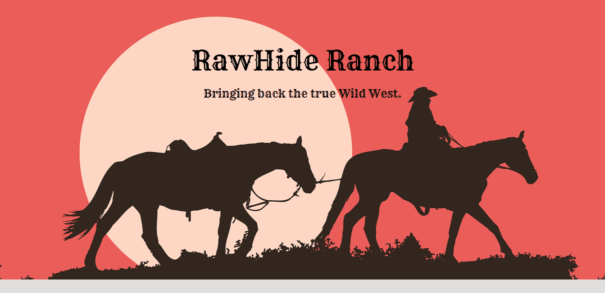
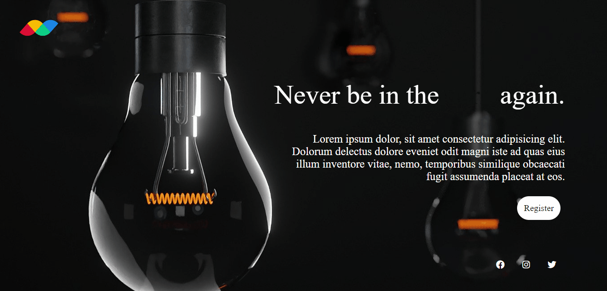
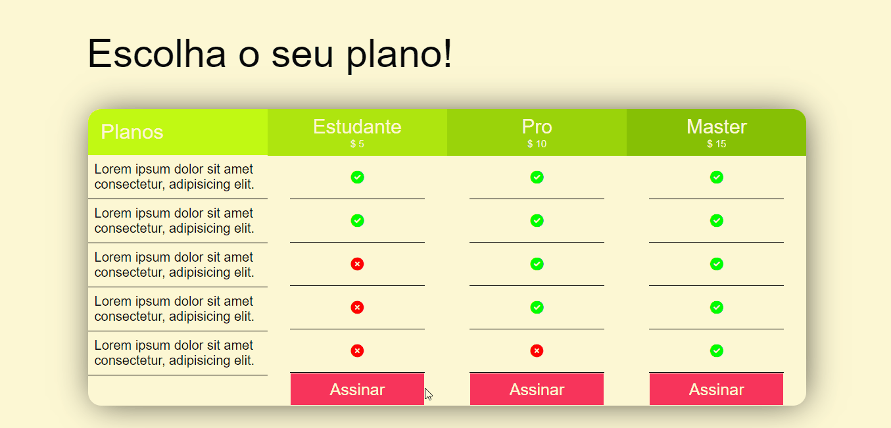
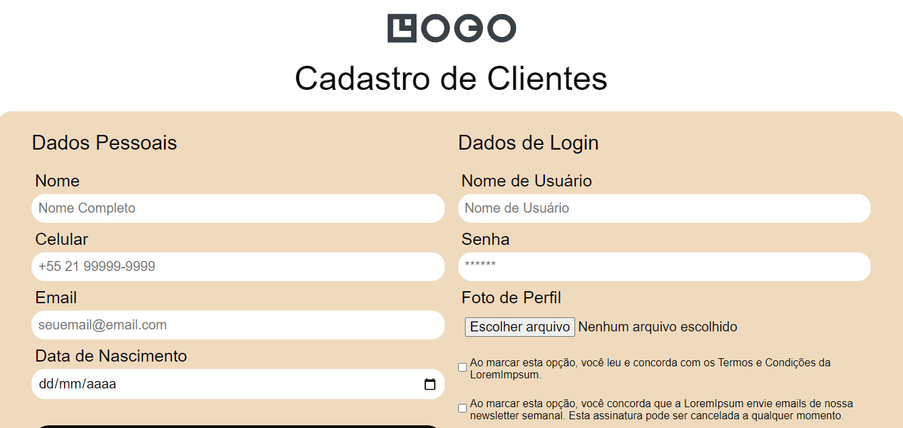
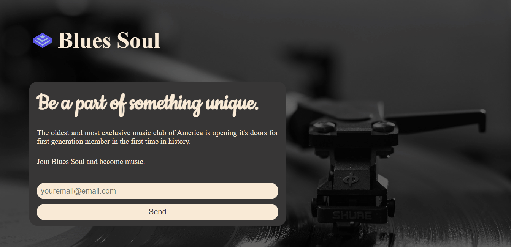
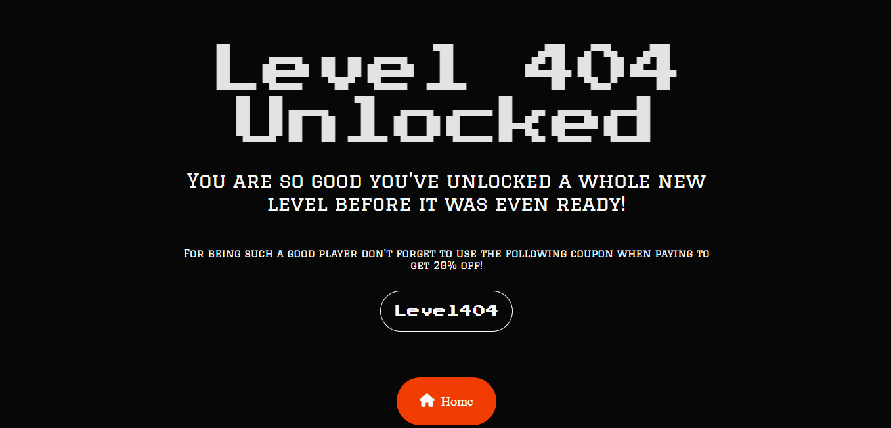
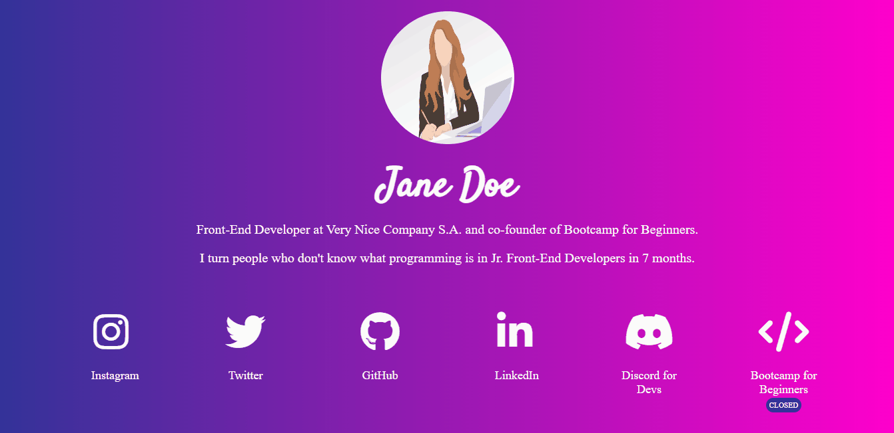

<h1 align="center"> Maratona HTML e CSS </h1>

<p align="center">
Série de projetos desenvolvidos exclusivamente em HTML e CSS ao longo de 15 dias com o objetivo de fixar e solidificar meus conhecimentos nas linguagens <br/>
</p>

<p align="center">
  <a href="#-tecnologias">Tecnologias</a>&nbsp;&nbsp;&nbsp;|&nbsp;&nbsp;&nbsp;
  <a href="#-rode-local">Rode Localmente</a>&nbsp;&nbsp;&nbsp;|&nbsp;&nbsp;&nbsp;
  <a href="#-english-version">English Version</a>&nbsp;&nbsp;&nbsp;&nbsp;&nbsp;&nbsp;
</p>

## 🚀 Tecnologias

Esse projeto foi desenvolvido com as seguintes tecnologias:

- HTML
- CSS
  
## ⚙ Projetos

| Projetos |Preview |
|-------------|--------------|
|Página In Memorian |  |
|Formulário de Pesquisa |  |
|Parallax |  |
|Landing Page de Seção Única |  |
|Cardápio de Café |  |
|Landing Page de Eventos |  |
|Exposição de Fotos |  |
|Grid de Preços |  |
|Formulário de Cadastro |  |
|Landing Page de Leads |  |
|E-Commerce |  |
|Página de Erro |  |
|Árvore de Links |  |
|Template de Blog |  |
|Página de Download de Ebook |  |
|Card de Resumo do Pedido |  |
|Card NFT |  |
|Template de Rede Social |  |


💻 Rode Local
Para rodar o projeto localmente, basta cumprir as seguintes etapas:

1. Git clone
   ```
   git clone https://github.com/ssschneider/maratona-html-e-css
   ```
2. Comece a modificar ou lançaar cada pasta conforme a sua preferência

## 🌎 English Version

HTML and CSS Marathon is a series of project developed exclusively in HTML and CSS thought 15 days with the goal on solidifying my knowledge in these languages.. To do that, I've used:
- HTML and CSS

> You can run locally following these steps:
1. Git clone
   ```
   git clone https://github.com/ssschneider/maratona-html-e-css
   ```
2. Modify or launch each repository as preferred

---
### Desenvolvido por Sarah Schneider 🖖